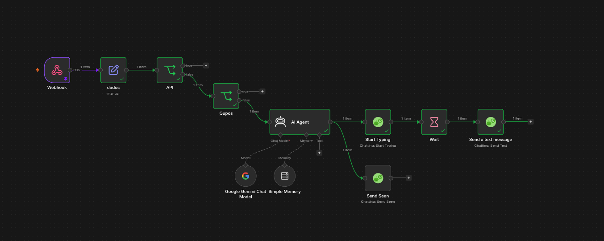
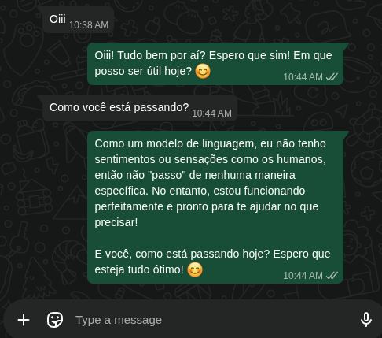

# Automacao n8n + WhatsApp + WAHA

Projeto local para estudos e automações com n8n, Docker e WAHA.

Esta aplicação foi baseada no ambiente de automação disponibilizado gratuitamente por Guilherme Lazarotto no YouTube.

- YouTube: https://www.youtube.com/@guilherme_laz
- Curso: https://www.curson8n.com.br

## Serviços

- n8n: http://localhost:5678
- WAHA: http://localhost:3000

## Como rodar

```bash
docker compose up -d
```

Para parar os containers:

```bash
docker compose down
```

## Objetivo

Usar o n8n como orquestrador de automacoes e o WAHA como ponte HTTP para integracao com WhatsApp.

## Demonstração

Fluxo da automação no n8n:



Exemplo de conversa automatizada pelo WhatsApp:



## Estrutura

- `assets/chat_ai.png`: captura de exemplo da automacao no WhatsApp.
- `assets/flux_ai.png`: captura do fluxo da automacao no n8n.
- `docker-compose.yml`: sobe os containers do n8n e do WAHA.
- `README.md`: instrucoes basicas do projeto.

## Observação

Não suba credenciais, tokens, sessoes do WhatsApp ou arquivos `.env` para o GitHub.
